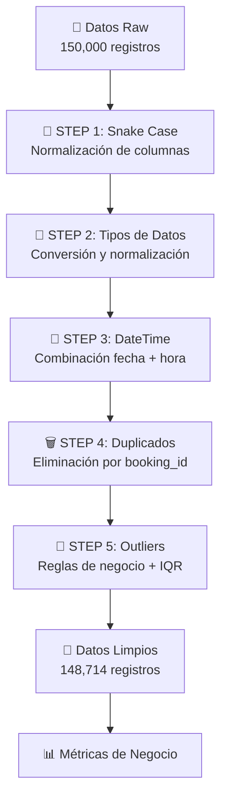

# 🚗 Ride Bookings ETL Pipeline

Un pipeline ETL robusto para el procesamiento de datos de reservas de viajes, implementando reglas de negocio específicas y análisis de calidad de datos.

## ✒️ Autores

> - Alejandro Londoño Bermúdez - A00395978
> - Juan David Colonia Aldana - A00395956
> - Miguel Ángel Gonzalez Arango - A00395687

## 📋 Tabla de Contenido

- [Descripción del Proyecto](#-descripción-del-proyecto)
- [Estructura del Proyecto](#-estructura-del-proyecto)
- [Instalación](#-instalación)
- [Reglas de Negocio](#-reglas-de-negocio)
- [Pipeline ETL](#-pipeline-etl)
- [Métricas de Negocio](#-métricas-de-negocio)

## 🎯 Descripción del Proyecto

Este proyecto implementa un pipeline ETL completo para procesar datos de reservas de viajes (ride bookings), aplicando transformaciones de datos, validaciones de calidad y reglas de negocio específicas para generar métricas confiables.

### Características Principales

- ✅ **Procesamiento de 150,000+ registros** de reservas de viajes
- ✅ **Reglas de negocio específicas** por estado de reserva
- ✅ **Detección inteligente de outliers** con enfoque conservador
- ✅ **Validaciones de calidad de datos** robustas
- ✅ **Métricas de negocio automatizadas**
- ✅ **Pipeline modular y extensible**

## 📁 Estructura del Proyecto

```
ride-bookings/
├── data/
│   └── ncr_ride_bookings.csv      # Datos de entrada (150K registros)
├── output/
│   └── ride_bookings.csv          # Datos procesados y limpios
├── utils/
│   ├── extract.py                 # Extracción de datos
│   ├── transform.py               # Transformaciones y limpieza
│   ├── load.py                    # Carga y métricas
│   └── queries.py                 # Consultas de negocio
├── main.py                        # Pipeline principal
├── requirements.txt               # Dependencias
└── README.md                      # Documentación
```

## 🚀 Instalación

### Pasos de Instalación

1. **Clonar o descargar el proyecto**

```bash
cd ride-bookings
```

2. **Crear entorno virtual (recomendado)**

```bash
python -m venv venv
source venv/bin/activate  # En Windows: venv\Scripts\activate
```

3. **Instalar dependencias**

```bash
pip install -r requirements.txt
```

### Ejecución

```bash
python main.py
```

## 🔧 Reglas de Negocio

El sistema implementa reglas de negocio específicas basadas en el estado de la reserva (`booking_status`):

### 📊 Estados de Reserva y Reglas

#### 1. **Completed** (Viajes Completados)

**Reglas:**

- ✅ **DEBE tener:** `booking_value`, `ride_distance`, `driver_ratings`, `customer_rating`
- ❌ **NO debe tener:** razones de cancelación (`reason_for_cancelling_by_customer`, `driver_cancellation_reason`, `incomplete_rides_reason`)

**Validaciones adicionales:**

- Aplicación de **IQR conservador** para detección de outliers extremos

#### 2. **Cancelled by Customer** (Cancelado por Cliente)

**Reglas:**

- ✅ **DEBE tener:** `reason_for_cancelling_by_customer`
- ❌ **NO debe tener:** `driver_ratings`, `customer_rating`, `ride_distance`, `driver_cancellation_reason`, `incomplete_rides_reason`

#### 3. **Cancelled by Driver** (Cancelado por Conductor)

**Reglas:**

- ✅ **DEBE tener:** `driver_cancellation_reason`
- ❌ **NO debe tener:** `driver_ratings`, `customer_rating`, `ride_distance`, `reason_for_cancelling_by_customer`, `incomplete_rides_reason`

#### 4. **Incomplete** (Viajes Incompletos)

**Reglas:**

- ✅ **DEBE tener:** `incomplete_rides_reason`, `booking_value`
- ❌ **NO debe tener:** `driver_ratings`, `customer_rating`, `reason_for_cancelling_by_customer`, `driver_cancellation_reason`

#### 5. **Driver Not Found** (Conductor No Encontrado)

**Reglas:**

- ❌ **NO debe tener:** `driver_ratings`, `customer_rating`, razones de cancelación
- ⚠️ **Flexibilidad:** Otros campos pueden ser nulos según el contexto

### 🛡️ Validaciones Universales

**Aplicables a todos los estados:**

1. **Ratings válidos:**

   - `driver_ratings` y `customer_rating`: rango [0, 5]
   - Permite valores nulos cuando corresponde

2. **Valores numéricos no negativos:**
   - `booking_value`, `ride_distance`, `avg_vtat`, `avg_ctat` ≥ 0
   - Permite valores nulos cuando corresponde

## ⚙️ Pipeline ETL

### Flujo de Procesamiento



### Detalle de Transformaciones

#### STEP 1: Normalización de Columnas

- Conversión a `snake_case`
- Ejemplo: `"Booking Status"` → `"booking_status"`

#### STEP 2: Conversión de Tipos

- **Numéricos:** `booking_value`, `ride_distance`, `ratings`, etc.
- **Categóricos:** normalización con `lowercase` y `underscores`

#### STEP 3: Creación de DateTime

- Combinación de columnas `date` y `time`
- Eliminación de columnas originales

#### STEP 4: Eliminación de Duplicados

- Identificación por `booking_id`
- **Resultado:** -1,233 registros duplicados

#### STEP 5: Detección de Outliers

- **Validaciones universales** (ratings, valores negativos)
- **Reglas de negocio específicas** por estado
- **IQR conservador** solo para viajes completados

## 📈 Métricas de Negocio

### Métricas Calculadas

| Métrica               | Valor          | Descripción                            |
| --------------------- | -------------- | -------------------------------------- |
| **Total Income**      | $51,220,637.00 | Ingresos totales de viajes completados |
| **Average Distance**  | 24.64 km       | Distancia promedio por viaje           |
| **Cancellation Rate** | 25.01%         | Tasa de cancelación aparente           |
| **Data Quality**      | 99.04%         | Registros preservados tras limpieza    |

### Distribución por Estado

| Estado                | Cantidad | Porcentaje |
| --------------------- | -------- | ---------- |
| Completed             | 92,248   | 62.02%     |
| Cancelled by Driver   | 26,789   | 18.01%     |
| Cancelled by Customer | 10,402   | 6.99%      |
| Driver Not Found      | 10,401   | 6.99%      |
| Incomplete            | 8,927    | 6.00%      |
